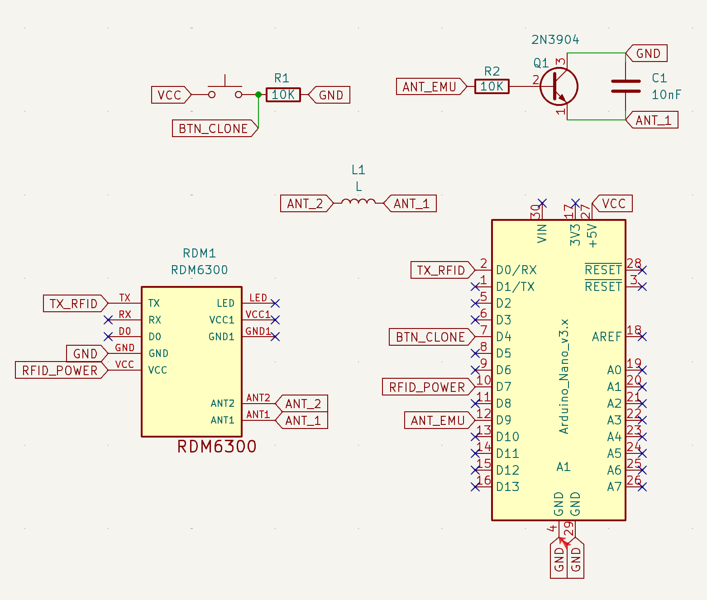

# simple-rfid
Arduino 125Khz RFID emulator / cloner / reader 

Components:
- RFID Reader RMD6300
- Arduino Nano

## Sponsorship

This project is kindly sponsored by [PCBWay](https://pcbway.com).
PCBWay specializes in manufacturing high-quality PCBs and makes them affordable to hobbyist and professionals alike.

The range of services they offer include PCB prototyping, assembly, instant quotes for your order, a verification process by a team
of experts and an easy to use, hassle-free order process.

I'm grateful to PCBWay for the support in creating this project.
